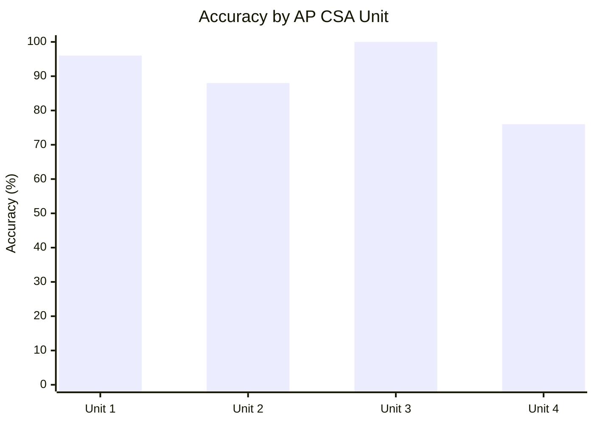
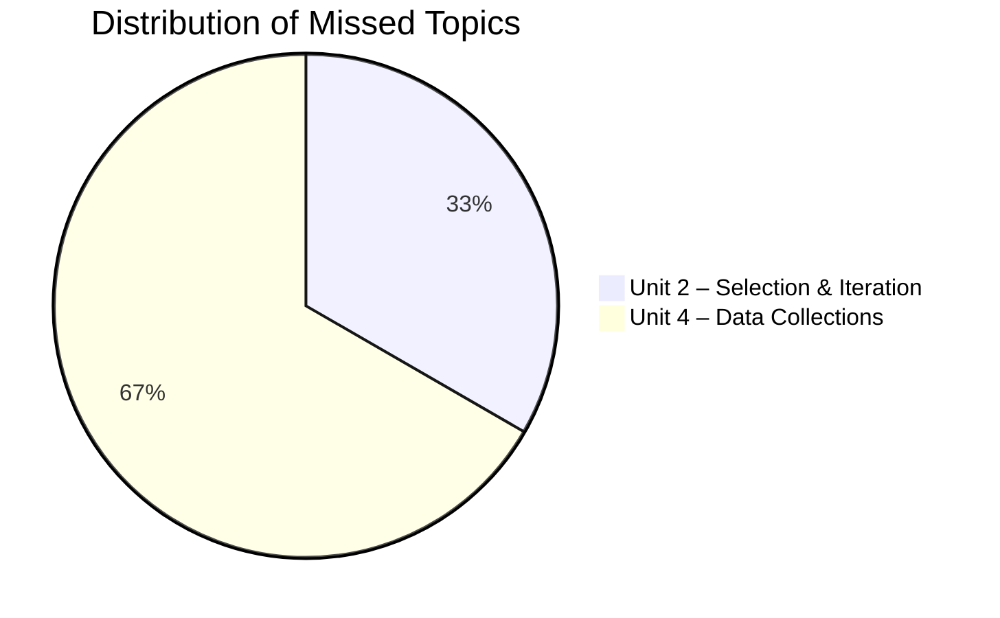
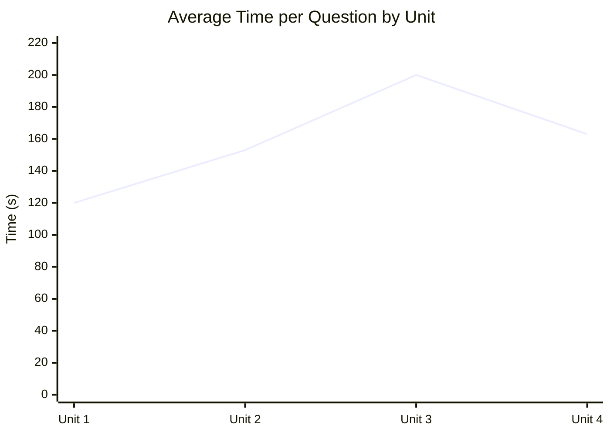
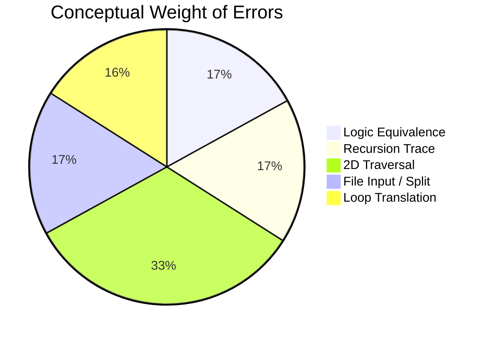

**Exam Stats**  
**Total Questions:** 42  **Correct:** 36  **Accuracy:** 85.7%  
**Total Time:** 1h 47m 59s  **Average Time per Question:** 2m 34s  

---

## I. Overview

This practice exam evaluated major learning objectives from Units 1–4 of AP Computer Science A, with questions distributed across variables, control structures, class design, and data collections.  
Overall, I demonstrated strong proficiency in **Units 1–3**, particularly with expressions, control flow, and object-oriented programming. My errors were concentrated in **Unit 4 (Data Collections)**—especially 2D array traversal and recursion—and one logic translation question from **Unit 2**.

---

## II. Performance by Unit



**Interpretation**
Units 1–3 show a clear mastery of Java fundamentals: expression evaluation, loop structure, and encapsulation.
Unit 4 presents a conceptual challenge involving traversal direction and recursive trace order—skills requiring both visualization and tracing precision.

---

## III. Topic-Level Breakdown

| **Question** | **Topic**                             | **AP Unit / Subtopic**             | **Result** |
| ------------ | ------------------------------------- | ---------------------------------- | ---------- |
| Q14          | Equivalent Boolean expression         | 2.5 – Compound Boolean Expressions | Incorrect  |
| Q29          | Recursive `printNums` method          | 4.16 – Recursion                   | Incorrect  |
| Q32          | Put 2D array data in an ArrayList     | 4.12 – 2D Array Traversals         | Incorrect  |
| Q36          | `my2Darr` after nested traversal      | 4.12 – 2D Array Traversals         | Incorrect  |
| Q38          | Build ArrayLists using Scanner        | 4.6 – Using Text Files             | Incorrect  |
| Q42          | `for` loop equivalent to `while` loop | 2.8 – for Loops                    | Incorrect  |



Four of the six missed questions originated from Unit 4, confirming that complex data traversal and file-handling operations are the main weakness area.

---

## IV. Deep Analysis, Approach, and Corrections

### **Q14 – Equivalent Boolean Expression**

**Topic:** Compound Boolean Logic
**My Approach:**
I quickly applied negation and assumed `!(A && B)` simplified to `(!A && !B)` without checking all cases. I thought both negated variables together would cancel the “and.”

**Correct Approach:**
Use **De Morgan’s Law**:
`!(A && B)` = `!A || !B`.
When the negation distributes, the operator changes from **and** to **or**.
The correct expression is therefore `(!isEven || !isPositive) && isPrime`.

**Correction:**
Validate logical equivalence with a truth table before committing to an answer. Visualize how negation flips the operator.

---

### **Q29 – Recursive `printNums` Method**

**Topic:** Recursion and Output Order
**Code:**

```java
public static void printNums(int n) {
  if (n < 50) {
    printNums(n * -2);
    System.out.print(n + " ");
  }
}
```

**My Approach:**
I focused only on the multiplication part (`n * -2`) and tried to list out values directly without tracing the recursive call order. I assumed the print happened before recursion.

**Correct Approach:**
The print statement occurs **after** the recursive call, so the function prints values in **reverse order** once recursion unwinds.
Tracing `printNums(10)`:

1. `n = 10` → calls `printNums(-20)`
2. `n = -20` → calls `printNums(40)`
3. `n = 40` → calls `printNums(-80)`
4. `n = -80` → base case fails (`n < 50` true but leads to another invalid branch)
   Eventually prints in this order: `-80 40 -20 10`

**Correction:**
For any recursive function, identify whether printing occurs **before** (preorder) or **after** (postorder) recursion to predict output order.

---

### **Q32 – 2D Array Data into an ArrayList**

**Topic:** Traversing a 2D Array in Specific Order
**My Approach:**
I selected the option that reversed both rows and columns because I misread the desired output order as bottom-to-top, right-to-left.

**Correct Approach:**
The intended output `[30, 20, 10, 60, 50, 40]` requires traversing **each row in reverse**, but keeping the **row order normal**.
This means:

```java
for (int j = 0; j < mat.length; j++) {
  for (int k = mat[0].length - 1; k >= 0; k--) {
    result.add(mat[j][k]);
  }
}
```

**Correction:**
Separate the logic for **row direction** and **column direction** when interpreting traversal patterns.

---

### **Q36 – my2Darr After Nested Traversal**

**Topic:** Nested Iteration and Index Conditions
**My Approach:**
I focused on the shape of the array (4×3) but miscounted which indices satisfied the condition `r == c`. I thought it continued down both diagonals.

**Correct Approach:**
Only cells where `r` equals `c` are modified. Since columns go from 0 to 2, valid pairs are `(0,0), (1,1), (2,2)`.
Result:

```
{ {0,0,0},
  {0,1,0},
  {0,0,2},
  {0,0,0} }
```

**Correction:**
When dimensions differ, ensure you check the valid overlap range of row and column indices (`min(rows, columns)`).

---

### **Q38 – Build ArrayLists Using Scanner**

**Topic:** Reading Text Files and Using String.split()
**My Approach:**
I used two separate `while` loops to read tokens into each list, assuming the file had enough data for both. I forgot that once the first loop finishes, `Scanner` has no remaining input.

**Correct Approach:**
Use one loop and split each line into two parts:

```java
while (sc.hasNext()) {
  String[] temp = sc.next().split("_");
  firstList.add(temp[0]);
  secondList.add(temp[1]);
}
```

**Correction:**
A `Scanner` consumes data linearly; subsequent loops find no data left. Always process tokens in the same loop if each line corresponds to multiple data items.

---

### **Q42 – For Loop Equivalent to While Loop**

**Topic:** Translating `while` → `for` Constructs
**Original Code:**

```java
int j = 0;
int sum = 0;

while (j <= 5) {
  j++;
  sum += j;
}
```

**My Approach:**
I converted it to a standard `for` loop (`for (int j = 0; j <= 5; j++)`) but ignored that `j` also increments inside the loop body, effectively halving the iterations.

**Correct Approach:**
Adjust the loop bounds to ensure the same number of additions (from 1 to 6):

```java
int sum = 0;
for (int j = 1; j <= 6; j++) {
  sum += j;
}
```

**Correction:**
When converting loops, count how many times each variable changes per iteration and where that change occurs.

---

## V. Quantitative Trends

### Time Spent per Unit (Approximation)

| **Unit** | **Total Questions** | **Total Time (min)** | **Average per Question (s)** |
| -------- | :-----------------: | :------------------: | :--------------------------: |
| Unit 1   |          11         |          22          |              120             |
| Unit 2   |          11         |          28          |              153             |
| Unit 3   |          6          |          20          |              200             |
| Unit 4   |          14         |          38          |              163             |



**Observation:**
Time allocation aligns with complexity—OOP design questions (Unit 3) required the most time but yielded perfect accuracy, while Unit 4 consumed similar time yet produced lower accuracy, indicating a need for *targeted practice*, not more time per se.

---

## VI. Synthesis

### Strengths

* Fluent command of **Java syntax and semantics** across Units 1–3.
* Effective debugging and prediction of simple iteration outcomes.
* Complete mastery of **class diagrams, constructors, and encapsulation logic**.

### Weaknesses

* Conceptual visualization in **recursive and 2D iterative reasoning**.
* Logical simplification under time pressure (Boolean algebra).
* Oversight in file-reading and token parsing patterns.

### Conceptual Diagnosis



---

## VII. Action Plan

| **Focus Area**                   | **Planned Method**                                                        | **Metric of Mastery**           | **Target Date** |
| -------------------------------- | ------------------------------------------------------------------------- | ------------------------------- | :-------------: |
| Boolean logic & De Morgan’s laws | Construct truth-tables for 10 sample expressions                          | ≥ 90% accuracy on logic drills  |      Nov 8      |
| Recursion tracing                | Manually trace 15 recursive outputs; verify via IDE                       | Consistent call-stack reasoning |      Nov 10     |
| 2D array traversals              | Diagram and code 10 distinct patterns (row-major, column-major, diagonal) | Zero incorrect traversals       |      Nov 12     |
| File input parsing               | Practice 5 Scanner-split problems from Unit 4.6                           | Perfect list population         |      Nov 14     |
| Loop equivalence                 | Convert 10 while-loops to for-loops and vice-versa                        | No semantic mismatches          |      Nov 16     |

---

## VIII. Conclusion

This exam underscored a distinction between **procedural fluency** and **conceptual visualization**.
My proficiency in writing, debugging, and reasoning about control structures is solid, yet certain data-oriented abstractions—particularly recursion and matrix traversal—require deliberate visualization practice.
The upcoming review cycle will focus less on memorization and more on tracing logic and data flow systematically, ensuring comprehensive readiness for the full AP CSA exam.

