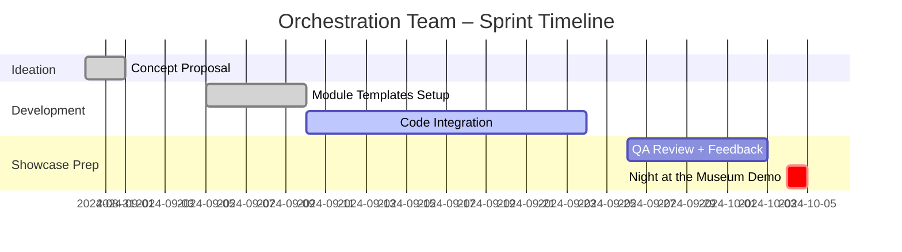
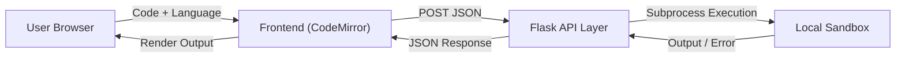

## Introduction

The **Quest of Code** was one of the most ambitious and rewarding projects of our AP Computer Science A course. Rather than focusing on isolated programming exercises, our class embarked on a **collaborative engineering journey** to design, implement, and deploy a **school-wide Computer Science Portfolio Portal**.  

This project transformed the classroom into an authentic development studio, where each team specialized in a distinct domain—frontend, backend, AI, data, orchestration, or resume building—and contributed a module to the greater “mega-quest.” The ultimate goal was to create a platform that allows students to **showcase their work, demonstrate mastery, and reflect on their growth** as computer scientists.

---

## Vision and Framework

**Quest of Code** followed an agile, multi-phase structure inspired by real software engineering workflows. The initiative was designed under the **College Board AP CSA 2024 Framework**, the **CSTA Level 3A Standards**, and **ISTE Digital Citizenship competencies**.

### Learning Framework Alignment

| Standard | Description |
|-----------|--------------|
| **AP CSA: Program Design & Algorithm Development** | Structured program decomposition using classes, methods, and algorithms. |
| **CSTA 3A-AP-22** | Collaborative programming through GitHub, code reviews, and version control. |
| **ISTE: Innovative Designer** | Iterative prototyping and testing using Agile sprints. |

### Project Architecture Diagram

```mermaid
flowchart LR
  A[Ideation Phase] --> B[Storyboarding & Prototyping]
  B --> C[Development]
  C --> D[Integration & Testing]
  D --> E[Showcase & Reflection]
  E -->|Feedback Loop| A
  subgraph Tools
    F[GitHub Projects]
    G[Slack / Docs]
    H[Flask + Java]
    I[Frontend Frameworks]
  end
  C --> F
  C --> G
  C --> H
  C --> I
````

This structure ensured that our project not only covered technical skills, but also professional engineering practices such as **documentation, testing, deployment, and ethical development**.

---

## Phase Breakdown

Each team followed a five-phase workflow:

| **Phase**            | **Focus**                                  | **Deliverables**                  |
| -------------------- | ------------------------------------------ | --------------------------------- |
| **1. Ideation**      | Team purpose, concept, and target audience | Google Doc proposal               |
| **2. Storyboarding** | Visual flowcharts and UX mapping           | Wireframes + Technical diagrams   |
| **3. Development**   | Coding and iterative testing               | Functional module with commits    |
| **4. Integration**   | Cross-team system testing                  | Connected modules via shared APIs |
| **5. Showcase**      | Public presentation                        | Live demo at Night @ the Museum   |

---

## Team Roles and Collaboration

Each mini-quest represented a unique part of the ecosystem. Our orchestration team coordinated across all of them to ensure interoperability and thematic consistency.

```mermaid
graph TD
  subgraph Mega-Quest Portal
    A1[Creators – Frontend] --> B1[Unified UI Design]
    A2[Encrypters – Backend] --> B2[Data APIs & Database]
    A3[Applicators – Data Visualization] --> B3[Analytics + ML]
    A4[Thinkers – AI Usage] --> B4[Prompt Engineering]
    A5[Grinders – Resume Building] --> B5[Professional Branding]
    A6[Curators – Admin Tools] --> B6[Progress Tracking + Analytics]
    A7[Innovators – User Flow] --> B7[UX Integration + Navigation]
  end
  O[Orchestration Team] --> A1
  O --> A2
  O --> A3
  O --> A4
  O --> A5
  O --> A6
  O --> A7
```

The orchestration layer served as the **central management hub**, ensuring that all repositories followed consistent folder structures, environment configurations, and API connection standards.

---

## Orchestration Team Reflection

As a member of the **Orchestration Team**, my responsibility was to connect technical execution with project management. We acted as the backbone of the entire quest—bridging communication between creative teams and maintaining the structural integrity of the project.

### Our Core Responsibilities

* **System Coordination** – Defined standards for directory structure, naming conventions, and deployment methods.
* **Project Management** – Managed milestones and Kanban boards for over 30 modules.
* **Cross-Team Integration** – Oversaw data flow between Flask and Spring Boot services.
* **Feedback + Quality Control** – Reviewed code merges, checked documentation, and assisted with Git conflicts.
* **Presentation Support** – Helped teams prepare for **Night at the Museum** (N@tM), ensuring coherent presentation flow.

### Kanban and Workflow Visualization



---

## My Technical Contribution: Code Runner

The highlight of my personal contribution to the Quest of Code was developing a **Code Runner**, a full-featured, in-browser code compiler that supports Python, Java, and JavaScript.

**Live Demo:** [Code Runner](https://pages.opencodingsociety.com/code)

### Purpose and Impact

The Code Runner became a **core interactive element** of the portfolio portal.
Instead of static explanations, students can now execute code samples directly within lessons, visualize outputs instantly, and engage more deeply with programming concepts.

It represents the bridge between learning **how to code** and learning **why code works**.

---

### System Architecture



### Technical Stack

| Layer                | Technology                  | Description                                                   |
| -------------------- | --------------------------- | ------------------------------------------------------------- |
| **Frontend**         | HTML, CSS, JS, CodeMirror 5 | Code editor interface with syntax highlighting and live stats |
| **Backend API**      | Python Flask                | Routes for `/run/python`, `/run/java`, `/run/javascript`      |
| **Execution Engine** | Secure subprocess           | Isolated environment with 5-second timeout and error capture  |
| **Deployment**       | GitHub Pages + Gunicorn     | Static frontend + Flask backend for API execution             |

### Key Features

* Multi-language support (Python, Java, JavaScript)
* Real-time stats: line count, characters, and execution time
* Copy, clear, and sample-loading tools
* Keyboard shortcuts (Ctrl/Cmd + Enter to run)
* Example library with 6 predefined code templates per language
* Responsive design for mobile testing

### Example API Route

```python
@python_exec_api.route('/python', methods=['POST'])
def run_python():
    data = request.get_json()
    code = data.get("code", "")
    if not code.strip():
        return jsonify({"output": "⚠️ No code provided."}), 400
    with tempfile.NamedTemporaryFile(delete=False, suffix=".py") as tmp:
        tmp.write(code.encode())
        tmp.flush()
        try:
            result = subprocess.run(
                ["python3", tmp.name],
                capture_output=True,
                text=True,
                timeout=5
            )
            output = result.stdout + result.stderr
        except subprocess.TimeoutExpired:
            output = "⏱️ Execution timed out (5 s limit)."
    return jsonify({"output": output})
```

This API architecture proved stable and extensible. I later optimized it by adding exception handling for memory overflow and future support for sandboxed execution.

---

## Reflection and Personal Takeaways

Building the **Quest of Code** was more than just a class assignment—it was a **microcosm of professional software engineering**.
It demanded technical precision, organization, leadership, and communication.

### Key Lessons Learned

* **Systems Thinking:** Orchestration requires visualizing how independent modules interact over shared protocols and data structures.
* **Scalable Design:** Reusable APIs and modular code ensure long-term maintainability.
* **Ethical AI Use:** Code Runner promotes transparency and learning without relying on opaque AI-generated solutions.
* **Collaboration over Competition:** Success depended on synchronizing teams, not outperforming them.

---

## Future Development

| **Goal**          | **Description**                                                  | **Planned Tools**        |
| ----------------- | ---------------------------------------------------------------- | ------------------------ |
| Add C++ Execution | Extend compiler to include C/C++ with isolated container runtime | Docker sandbox + C++ GCC |

---

## Conclusion

The **Quest of Code** combined creativity, computation, and collaboration into a single unified experience. It taught me that building software isn’t just about writing code—it’s about **designing systems that communicate, evolve, and teach others**.

By orchestrating development across multiple domains and building the **Code Runner**, I helped shape a project that future students can continue expanding.
This quest not only strengthened my skills in full-stack development and coordination but also showed how high-school computer science can emulate the workflows of modern professional teams.

---

### References

* [CSTA Standards, 2017](https://csteachers.org/resources/csta-k-12-computer-science-standards/)
* [ISTE Standards for Students, 2016](https://www.iste.org/standards)
* [College Board: AP Computer Science A Framework, 2024](https://apcentral.collegeboard.org/)
* [Open Coding Society Curriculum Portal, 2025](https://pages.opencodingsociety.com)
* [GitHub Education Documentation](https://education.github.com/)