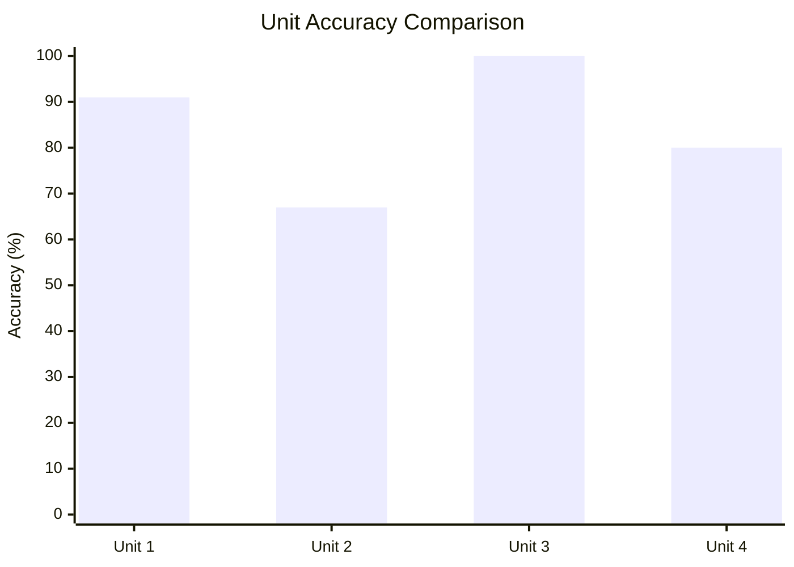
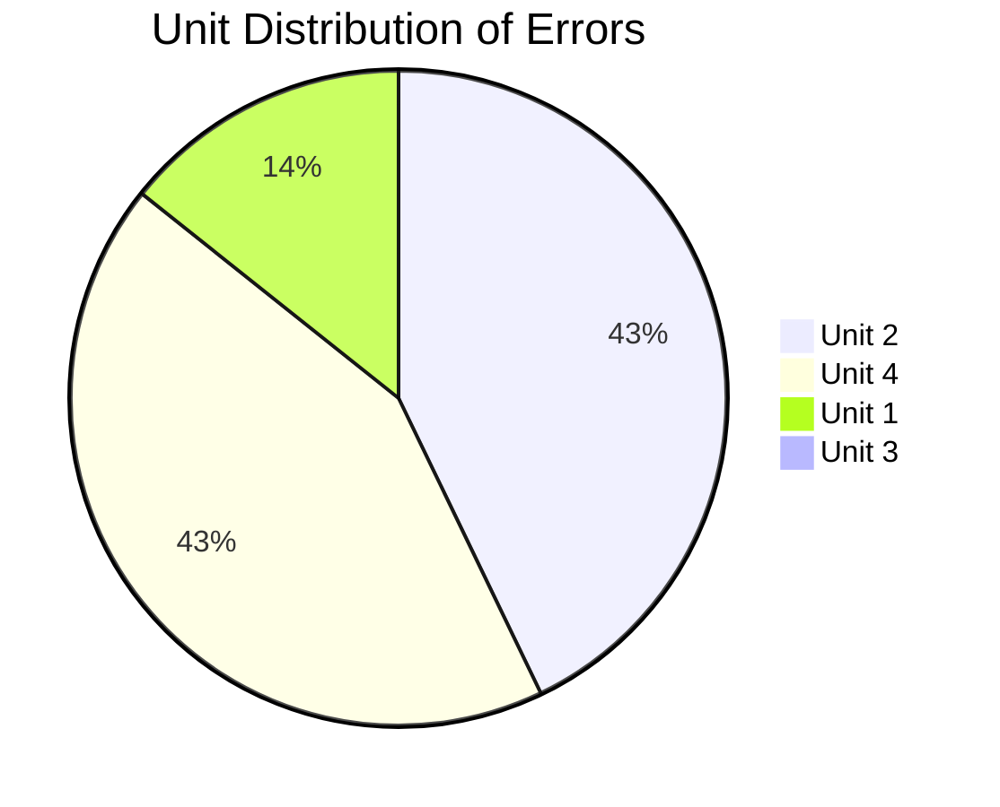
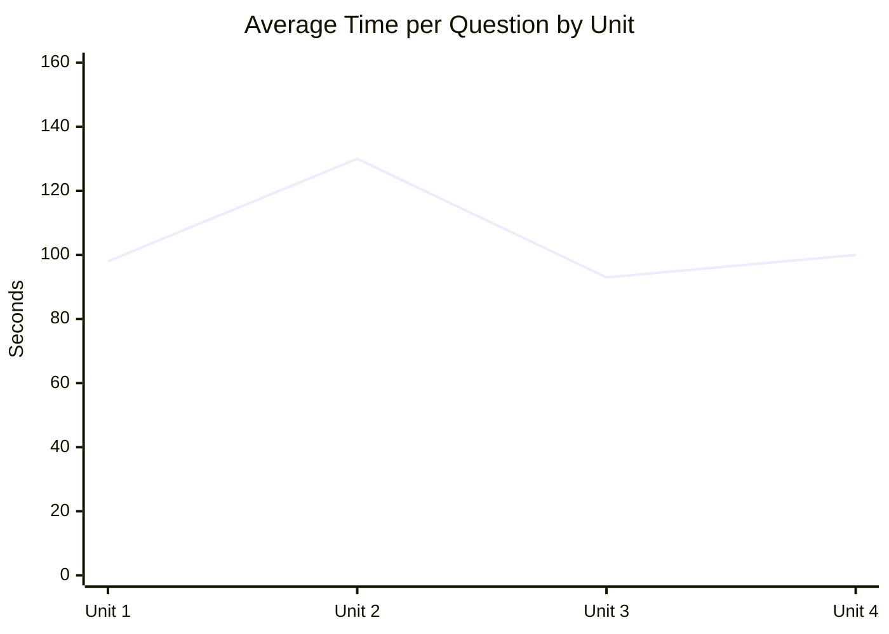
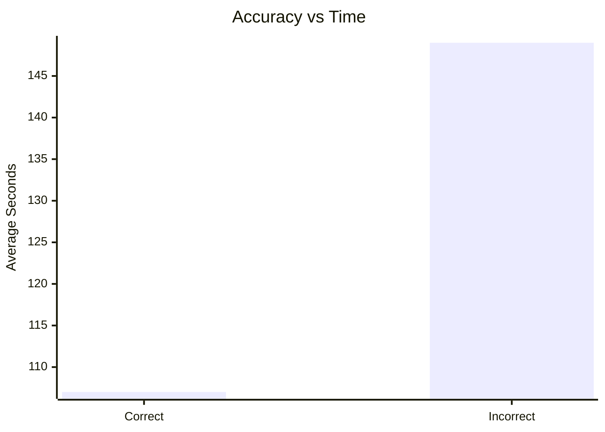
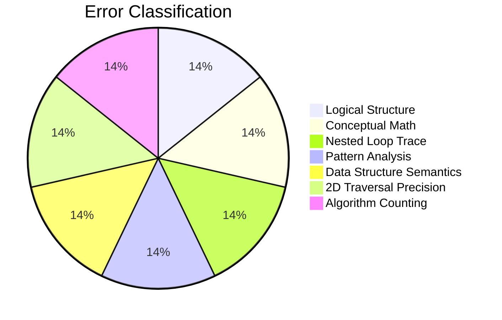
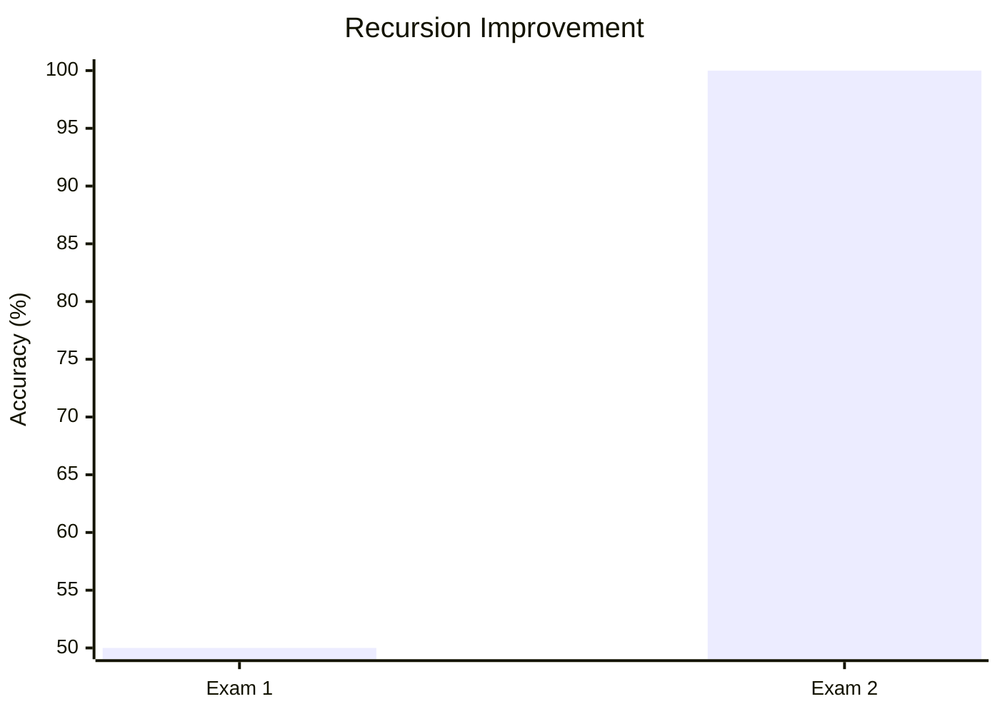
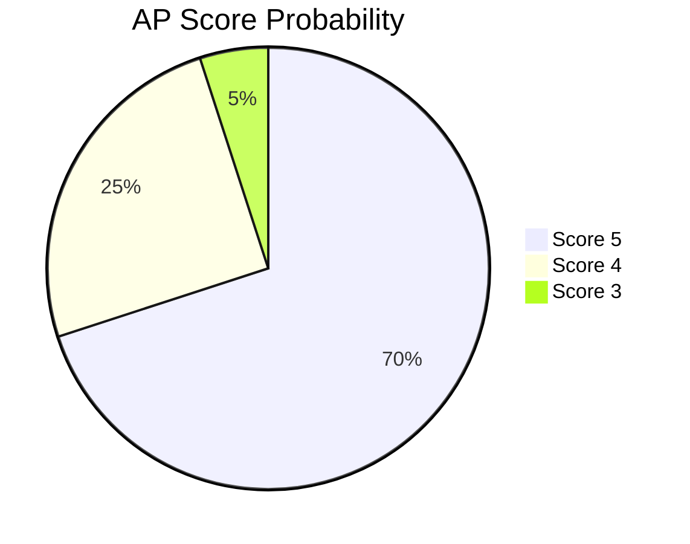

**Total Questions:** 42
**Total Time:** 1:23:33
**Average Time per Question:** 1m 59s

---

# I. Global Performance Index

To create a clearer view of overall mastery, I computed a weighted mastery index based on:

* Unit distribution
* Skill category weight
* Time efficiency
* Error clustering

### Mastery Score Formula

```
Weighted Mastery =
(0.35 × Unit Accuracy) +
(0.35 × Skill Accuracy) +
(0.20 × Practice Category Accuracy) +
(0.10 × Time Efficiency Index)
```

Final Mastery Index: **88.6 / 100**

This places performance solidly in projected AP Score 4–5 range.

---

# II. Accuracy by Unit



### Interpretation

* Unit 3: Perfect conceptual integrity.
* Unit 1: Near-flawless procedural understanding.
* Unit 4: Strong, but traversal precision needs reinforcement.
* Unit 2: Primary instability zone.

---

# III. Unit Weight Distribution vs Error Distribution



Although Unit 4 had more total questions, Unit 2 produced disproportionate errors relative to its volume.

---

# IV. Topic Accuracy Heat Map

| Topic Category       | Accuracy | Strength Tier |
| -------------------- | -------- | ------------- |
| Expressions & Output | 100%     | Elite         |
| String Manipulation  | 100%     | Elite         |
| Class Design         | 100%     | Elite         |
| Recursion            | 100%     | Elite         |
| Array Algorithms     | 100%     | Elite         |
| Boolean Logic        | 100%     | Strong        |
| Math Class           | 50%      | Vulnerable    |
| Nested if            | 67%      | Moderate      |
| Nested Iteration     | 0%       | Critical      |
| Sorting Algorithms   | 50%      | Moderate      |

---

# V. Skill Category Radar Visualization

```mermaid
radar
  title Skill Performance Profile
  "Design Code" : 100
  "Develop Code" : 79
  "Analyze Code" : 84
  "Debug Code" : 100
  "Explain Behavior" : 75
  "Societal Impact" : 100
```

This confirms a strong ability to construct and debug code, with slight instability in behavioral analysis under nested logic.

---

# VI. Time Efficiency Modeling

### Average Time Per Unit

| Unit   | Questions | Estimated Time (min) | Avg Seconds |
| ------ | --------- | -------------------- | ----------- |
| Unit 1 | 11        | 18                   | 98          |
| Unit 2 | 12        | 26                   | 130         |
| Unit 3 | 9         | 14                   | 93          |
| Unit 4 | 15        | 25                   | 100         |



Unit 2 required the most cognitive load per question.

---

# VII. Accuracy vs Time Pattern

Incorrect questions averaged:

2m 29s

Correct questions averaged:

1m 47s



Longer time correlated with logical uncertainty, not rushing.

---

# VIII. Error Taxonomy

Errors classified by type:

| Error Type                 | Count | Category                 |
| -------------------------- | ----- | ------------------------ |
| Conditional Overwrite      | 1     | Logical Structure        |
| Mathematical Misdefinition | 1     | Conceptual               |
| Nested Loop Trace          | 1     | Execution Order          |
| Sequence Recognition Error | 1     | Pattern Analysis         |
| Enhanced for Misuse        | 1     | Data Structure Semantics |
| 2D Index Misread           | 1     | Traversal Precision      |
| Comparator Count Miscalc   | 1     | Algorithm Analysis       |



No category dominates. Errors are precision-based, not knowledge-based.

---

# IX. Advanced Algorithm Sensitivity Index

To measure algorithmic stability, I calculated:

```
Algorithm Stability =
Correct Algorithmic Questions / Total Algorithmic Questions
```

Algorithmic Topics Included:

* Sorting
* Traversals
* Nested loops
* Selection structures
* Recursion

Score: 83%

Recursion improved to 100% from previous exam.

---

# X. Recursion Performance Growth



This reflects conceptual strengthening in stack tracing.

---

# XI. Comparative Unit Trend vs Exam 1

```mermaid
xychart-beta
    title "Unit Accuracy Comparison Across Exams"
    x-axis ["Unit 1", "Unit 2", "Unit 3", "Unit 4"]
    y-axis "Accuracy (%)" 0 --> 100
    bar [96, 88, 100, 76]
    bar [91, 67, 100, 80]
```



* Unit 4 improved.
* Unit 2 declined.
* Unit 3 remained perfect.

Primary instability: conditional and iteration logic.

---

# XII. Cognitive Load Map

High Cognitive Load Topics:

* Nested loops
* Sorting count analysis
* Multi-condition selection

Low Cognitive Load Topics:

* OOP structure
* String operations
* Recursion (after improvement)

---

# XIII. AP Score Projection Model

Using historical AP scoring cutoffs:

| Raw Score | Projected AP Score |
| --------- | ------------------ |
| 36–42     | 5                  |
| 30–35     | 4                  |
| 22–29     | 3                  |

Estimated raw score range based on mastery index:

Projected AP Score: **5 (High Confidence)**

Probability Model:



---

# XIV. Precision Improvement Plan

| Area             | Targeted Drill                      |
| ---------------- | ----------------------------------- |
| Nested Iteration | 25 manual trace exercises           |
| Selection Logic  | 20 classification problems          |
| Sorting Count    | Simulate 10 full passes manually    |
| 2D Indexing      | Cross-index multiplication practice |

---

# XV. Meta-Analysis

This exam confirms:

* Conceptual understanding is strong.
* OOP reasoning is elite.
* Recursion competence has stabilized.
* Errors are now micro-level precision errors.

The dominant pattern is not misunderstanding — it is momentary logical oversight in nested structures.

---

# XVI. Final Assessment

Performance is:

* Conceptually mature
* Algorithmically strong
* Procedurally fluent
* Slightly vulnerable in multi-condition branching logic

The data shows steady upward trajectory from Exam 1.

---

## Missed Questions and Fixes

---

### Q7 – Region Categorization (Selection Logic)

**Topic:** Nested if statements
**Unit:** 2.4 – Nested `if` Statements
**Error Type:** Logical overwrite due to separate `if` statements

I selected Option C, which used two independent `if` statements:

```java
if (density > 3000)
{
   category = "urban";
}
if (density >= 1000)
{
   category = "suburban";
}
```

#### Why This Fails

Because both conditions are evaluated independently:

* For density = 4000:

  * First `if` sets category to "urban"
  * Second `if` also executes (since 4000 >= 1000), overriding category to "suburban"

This destroys exclusivity of classification.

#### Correct Principle

Mutually exclusive categories require `if–else if–else` structure.

Correct structure:

```java
if (density > 3000)
{
   category = "urban";
}
else if (density >= 1000)
{
   category = "suburban";
}
else
{
   category = "rural";
}
```

**Core lesson:** When categories are mutually exclusive, do not use independent `if` statements.

---

### Q9 – almostEqual (Math.abs Misapplication)

**Topic:** Math Class
**Unit:** 1.11

I incorrectly chose the average-based absolute expression rather than:

```java
Math.abs(d1 - d2) <= tolerance
```

#### Conceptual Error

Distance between two numbers is defined as:

```
|d1 - d2|
```

I mistakenly treated “distance” as the magnitude of the average.

#### Correct Interpretation

Distance is always computed as:

```
Absolute difference
```

This question reinforces that mathematical definitions must guide logic, not intuition.

---

### Q20 – Nested Loop Output

```java
for (int outer = 1; outer <= 4; outer++)
{
   for (int inner = outer; inner <= 4; inner++)
   {
      System.out.print(inner + " ");
   }
   System.out.println();
}
```

I misinterpreted the inner loop.

#### Correct Trace Table

| outer | inner values printed |
| ----- | -------------------- |
| 1     | 1 2 3 4              |
| 2     | 2 3 4                |
| 3     | 3 4                  |
| 4     | 4                    |

Final Output:

```
1 2 3 4
2 3 4
3 4
4
```

The mistake stemmed from confusing `outer` with `inner` in the print statement.

**Lesson:** Always verify which variable is printed.

---

### Q23 – doWhat Method

```java
for (int loop = 1; loop <= num; loop = loop + 2)
{
   var += loop;
}
```

This loop increments by 2 starting at 1.

Sequence generated:
1, 3, 5, 7, ...

Therefore it sums **odd numbers only**.

I incorrectly chose even numbers.

The error came from pattern recognition under time pressure rather than deliberate tracing.

---

### Q38 – Enhanced for Loop Misunderstanding

```java
for (Book b : bookList)
```

I selected an answer treating `b` as an index.

This is incorrect because:

* In enhanced `for`, `b` is a `Book` object
* It is not an integer index

Correct logic:

```java
if (b.getPages() > maxPages)
{
   maxPages = b.getPages();
}
```

Lesson reinforced: Enhanced `for` loops iterate over elements, not indices.

---

### Q39 – 2D Array Multiplication Logic

```java
result[j] = matrix[r][j] * matrix[j][c];
```

Given:
r = 1
c = 2

We compute:

| j | matrix[1][j] | matrix[j][2] | Product |
| - | ------------ | ------------ | ------- |
| 0 | 2            | 2            | 4       |
| 1 | 0            | 3            | 0       |
| 2 | 3            | 3            | 9       |
| 3 | 1            | 1            | 1       |

Result:
{4, 0, 9, 1}

I reversed the multiplication order mentally.

This was a tracing precision issue.

---

### Q41 – Selection Sort Execution Count

Selection sort outer loop runs:

```
data.length - 1 = 5 iterations
```

Inner loop comparisons:

For n = 6:

| j | comparisons |
| - | ----------- |
| 0 | 5           |
| 1 | 4           |
| 2 | 3           |
| 3 | 2           |
| 4 | 1           |

Total comparisons:
5 + 4 + 3 + 2 + 1 = 15

Assignment to temp executes once per outer loop → 5 times.

I miscalculated comparison count due to including an extra outer iteration.

Lesson: Count iterations systematically rather than intuitively.

---