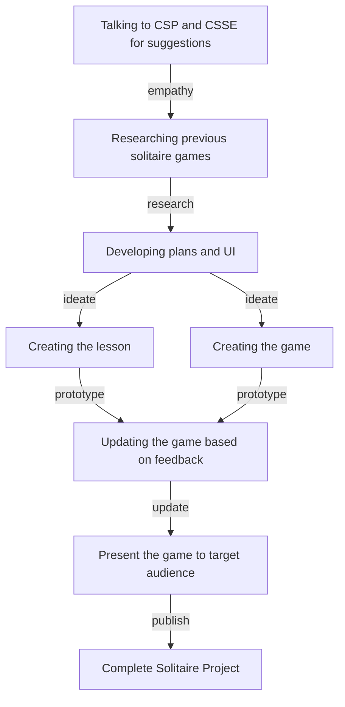

```mermaid
graph TD
    A[Talking to CSP and CSSE for suggestions] --> |empathy| B[Researching previous solitaire games]
    B --> |research| C[Developing plans and UI]
    C --> |ideate| D[Creating the lesson]
    C --> |ideate| E[Creating the game]
    D --> |prototype| F[Updating the game based on feedback]
    E --> |prototype| F
    F --> |update| G[Present the game to target audience]
    G --> |publish| H[Complete Solitaire Project]
```